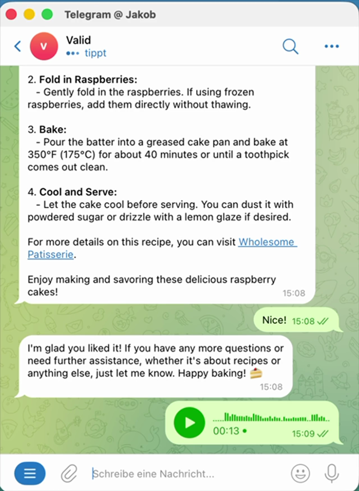

# VaultAgent: Self-Hosted AI Assistant for Telegram on Raspberry Pi or Remote Host (Rust)

VaultAgent is an open-source, self-hosted AI assistant written in Rust. It runs on Raspberry Pi or any Linux server, connects to Telegram, keeps persistent memory, executes tools in a Docker sandbox, and supports scheduled automation.

If you are looking for a private AI Telegram bot, a personal AI assistant on your own infrastructure, or an OpenClaw-inspired Rust agent, VaultAgent is built for exactly that.

## Demo

<a href="assets/short.mp4">
    
</a>

Click the image to watch the demo video: [`assets/short.mp4`](assets/short.mp4)

## Why VaultAgent

- **Self-hosted and private**: Your API keys stay on your machine
- **Rust performance**: Small binary footprint and low resource usage
- **Security-first architecture**: Tool execution is sandboxed in Docker
- **Extensible skills**: Built-in Rust tools plus auto-loaded Python skills
- **Always-on automation**: Cron reminders and recurring tasks

## Features

### Available now

- **Sandboxed tool execution**: Skills run inside a Docker worker; secrets never enter the sandbox
- **Telegram bot**: Polling mode and webhook mode
- **Multi-provider LLM integration**: Supports OpenAI-compatible providers and Anthropic, including runtime model switching
- **Persistent chat history**: Conversation history is saved to disk and restored on restart
- **Image input support**: Telegram photo messages are passed to the model as image content
- **Voice message transcription**: Telegram voice memos are transcribed via Whisper-compatible endpoints
- **Long-term memory**: Markdown-backed memory store with `memory_save` and `memory_search`
- **Cron scheduler**: One-shot and recurring tasks via `cron_add`, `cron_list`, and `cron_remove`
- **Python skills**: Drop a `.py` file into `skills/` and it is auto-registered as a tool
- **Web chat**: Basic browser interface (localhost)
- **Chat ID allowlist**: Restrict who can talk to your assistant

### Built-in tools

- File tools: `read_file`, `write_file`, `list_directory`
- Web tools: `web_search`, `web_fetch`, `research`
- Memory tools: `memory_save`, `memory_search`
- Automation tools: `cron_add`, `cron_list`, `cron_remove`
- System tool: `shell_execute`

## Background agent processes

VaultAgent already supports background-like behavior, but in a focused way:

- **Cron jobs run in the background** through the internal scheduler and trigger agent tasks automatically
- **Research subagent runs per request**, not as a permanent autonomous daemon

What is not there yet:

- No standalone long-running autonomous worker queue for arbitrary user tasks
- No separate per-task process lifecycle manager (pause/resume/cancel for detached agent tasks)

## Architecture

VaultAgent uses a split-process security model: the host orchestrator handles Telegram, LLM calls, and secrets; all tool execution runs in a sandboxed Docker worker.

```
┌────────────────────────────────────────────────┐
│  HOST (Raspberry Pi / Server)                  │
│                                                │
│  .env.secure (API keys, tokens)                │
│                                                │
│  ┌─────────────┐  ┌─────────────┐              │
│  │  Telegram   │  │  Web Chat   │              │
│  │  Gateway    │  │  Gateway    │              │
│  └──────┬──────┘  └──────┬──────┘              │
│         │                │                     │
│         └──────┬─────────┘                     │
│                ▼                               │
│      ┌───────────────┐  ┌──────────┐           │
│      │    Agent      │  │   Soul   │           │
│      │  (LLM loop)   │◄─┤(readonly)│           │
│      └───────┬───────┘  └──────────┘           │
│              │ HTTP (:9100)                    │
└──────────────┼─────────────────────────────────┘
               │
┌──────────────┼──────────────────────────────────┐
│  DOCKER SANDBOX                                 │
│  .env.docker (no secrets)                       │
│                                                 │
│  ┌──────────────────────────────────┐           │
│  │  Worker HTTP API (:9100)         │           │
│  │  POST /execute      run skills   │           │
│  │  GET  /definitions               │           │
│  └──────────────────────────────────┘           │
│                                                 │
│  Mounted: soul/, skills/, cron/                 │
│  Security: read-only rootfs, no-new-privileges, │
│            cap_drop ALL, RAM/PID limits         │
└─────────────────────────────────────────────────┘
```

### Security properties

- API keys (`OPENAI_API_KEY`, `ANTHROPIC_API_KEY`, `TELEGRAM_BOT_TOKEN`) exist only on the host
- Worker is isolated and authenticated with `WORKER_TOKEN`
- Container runs with reduced privileges and resource limits
- Only mounted directories (`soul/`, `skills/`, `cron/`) are writable

## Getting started

### Prerequisites

- Rust (edition 2024): https://rustup.rs/
- Docker + Docker Compose
- Telegram bot token via @BotFather
- OpenAI-compatible API key or Anthropic API key
- For deploy target: Linux aarch64 server (for example Raspberry Pi 3/4/5, 64-bit OS)

### Standard installation (recommended)

Use this default flow for production/self-hosted usage:
`setup.sh` (guided config) -> `deploy.sh` (build + remote install + systemd).

1. Clone the repository

```bash
git clone https://github.com/your-username/vaultagent.git
cd vaultagent
```

2. Run guided setup

From repo root:

```bash
bash setup.sh
```

The script creates/updates:

- `vaultagent/.env.secure`
- `vaultagent/.env.docker`
- optionally `vaultagent/trusted_chat_ids.md`

3. Deploy to server/Raspberry Pi

Quick deploy:

```bash
./deploy.sh <host>
```

Examples:

```bash
./deploy.sh jarvis
./deploy.sh 192.168.1.42
DEPLOY_HOST=jarvis ./deploy.sh
```

After deploy, follow logs:

```bash
ssh user@server 'journalctl -u vaultagent -f'
```

### Run locally (optional)

If you want to run without remote deploy:

1. Ensure env files exist (`bash setup.sh` is the easiest way).
2. Start worker:

```bash
cd vaultagent
docker compose up -d
```

3. Start host orchestrator:

```bash
export $(grep -v '^#' .env.secure | xargs)
cargo run
```

Allowlist options:

- `TELEGRAM_ALLOWED_CHAT_IDS` in `vaultagent/.env.secure` (comma-separated)
- optional `vaultagent/trusted_chat_ids.md` (one ID per line)

## Deploy to Raspberry Pi

`deploy.sh` cross-compiles for `aarch64-unknown-linux-musl`, copies assets, starts Docker worker, and installs a systemd service.

First-time setup:

```bash
rustup target add aarch64-unknown-linux-musl
brew install filosottile/musl-cross/musl-cross --with-aarch64
```

Deploy examples:

```bash
./deploy.sh
./deploy.sh 192.168.1.42
DEPLOY_HOST=jarvis ./deploy.sh
```

Useful operations:

```bash
ssh user@server 'journalctl -u vaultagent -f'
ssh user@server 'sudo systemctl restart vaultagent'
ssh user@server 'sudo systemctl stop vaultagent'
```

You can also send `/reboot` in Telegram.

## Telegram commands

The bot handles these commands directly:

| Command          | Description                                 |
| ---------------- | ------------------------------------------- |
| `/new`           | Reset current conversation history          |
| `/window`        | Show context window usage                   |
| `/tools`         | List registered tools                       |
| `/stats`         | Show today’s token usage                    |
| `/models`        | Open model picker buttons (active model ✅) |
| `/models <name>` | Switch model at runtime                     |
| `/reboot`        | Restart service (systemd brings it back up) |

## Project structure

```
vaultagent/
├── src/
│   ├── main.rs
│   ├── worker.rs
│   ├── gateway/
│   │   ├── IncomingActionsQueue.rs
│   │   └── com/
│   │       ├── telegram/
│   │       └── website/
│   ├── reasoning/
│   │   ├── agent.rs
│   │   ├── llm_interface.rs
│   │   ├── llmApis/openAI.rs
│   │   ├── usage.rs
│   │   └── transcription.rs
│   ├── skills/
│   │   ├── mod.rs
│   │   ├── default_skills/
│   │   └── python_skill.rs
│   ├── cron/
│   │   ├── store.rs
│   │   └── scheduler.rs
│   └── soul/
├── soul/
├── skills/
├── cron/
├── trusted_chat_ids.md
├── .env.secure.example
├── .env.docker.example
├── Dockerfile.worker
├── docker-compose.yml
└── Cargo.toml
```

## License

This project is licensed under GNU Affero General Public License v3.0 (AGPL-3.0). See [LICENSE](LICENSE).

## Acknowledgments

VaultAgent is inspired by [OpenClaw](https://github.com/openclaw/openclaw) and follows the same core vision: a personal, self-hosted AI assistant with memory, personality, and extensible tools.
